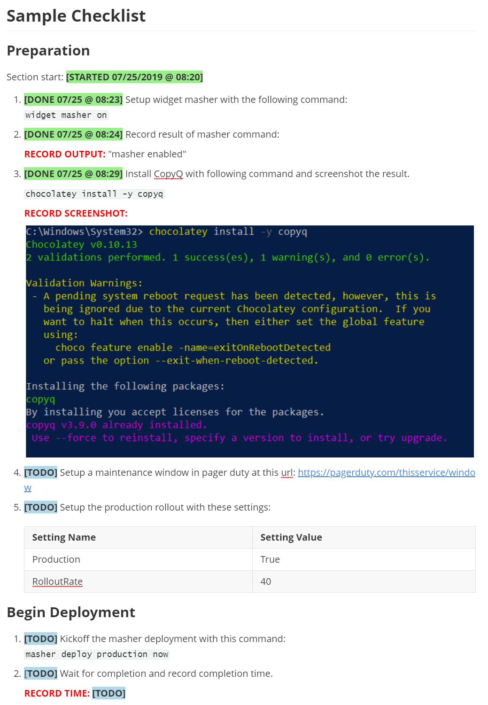

---

---

# Markdown Checklists Method

## Checklists ~~versus~~ AND DevOps Automation

While automation trumps human checklists, there are balancing considerations that make checklists a temporary or permanent necessity:

- If automation needs frequent updating between usages (highly variable process) the cost of maintenance and DevOps style CI and automated QA testing - as well as the associated time and instability costs - can exceed the costs of doing a well managed checklist for years into the future.  Automation is development, development has both implementation and maintenance costs.
- Full automation development and maintenance is frequently not cost justifiable for systems that are on their way to retirement.
- If the system involves third party software as middleware or main componentry, the managing team may not have all necessary automation APIs available for 100% automation.
- Changes in systems that underlie the change process cost a lot more to recode than to re-checklist.
- A detailed checklist (along with adding code snippets where ever possible over time) is the required source material for building automation in a productive manner (that does use the automation code development as the method of discovering the process already known by humans which is an inefficient use of development resources.)  This facilitates a gradual, iterative approach to automation that is advocated by many.

## Markdown Checklist Benefits and Limitations

### Benefits

- Checklist templates in source control.
- Completed checklists in source control.
- Rendering in source control web UI.

### Limitation To Work Around

- Markdown checkboxes do not work well nor render when used with NUMBERED bullets, but numbered bullets are helpful or necessary for large checklists.

## Typora For Checklists

### Typora Features That Make Markdown Workable for Checklists

Typora is a markdown editor that unifies the markdown editing experience into one pain that both edits and renders markdown.  Editing is accomplished via inserting markdown (which is immediately rendered) or through menu commands like a word processor like Microsoft Word.

1. Multiplatform for DevOps teams - Windows, Mac, Linux. (electron based)
2. Free.
3. Creates **standard** markdown - renders properly in code editors and source control web UIs.
4. **DISTINGUISHING FEATURE:** Visual editing that takes markdown directly (and converts it on the fly) - all in one pane.
5. Menu, Right-click and familiar hotkeys for common word processing formatting like Bolding (that creates native MD)
6. **DISTINGUISHING FEATURE:**  Table of Contents builder.
7. **DISTINGUISHING FEATURE:** Outline navigation mode makes complex checklists easier to construct and navigate. (once you've installed Typora, view this very document in it to see how helpful this is)
8. **DISTINGUISHING FEATURE:** Excellent table support.
9. Strikethrough hotkeys for marking items done (CTRL-SHIFT-5).
10. **SERIOUSLY DISTINGUISHING FEATURE:** Ability to paste graphics and relocate the graphic into the repo folder without leaving the editor.  Usable for creating checklists with screenshot instructions and completing checklists with recorded screenshots for completion evidence.
11. Source control / Code editor agnostic - works as a reader and writer and regardless of source control technology or code editor in use by a team or individual. (although you must update the path to be relative, not fully resolved - easily done in the editor)
12. Replaces currently selected text with a paste operation (easy replacement / update of stamps)
13. Undo functionality - easy undo of stamping.
14. Spellcheck !

### CopyQ Features That Make Checklists More Workable

If you exclusively use the built in Strikethrough hotkey of Typora to mark items "Done", then you would not need to add CopyQ to the solution.  If you want more flexibility with Done stamping, other kinds of stamps, and standard, formatted markdown inserting, CopyQ rocks.

CopyQ is a multiplatform clipboard management tool.  It can insert standard bits of text. Since Typora supports direct input of markdown - clips you build in CopyQ can include straight markdown for formatting.  In addition it can insert a formatted current date time stamp.  It can controlled with user defined hotkeys.

1. Multiplatform for DevOps teams - Windows, Mac, Linux. (QT Based)
2. Free.
3. Supports text insertion macros into anything - including Typora.
4. Since Typora receives markdown directly, the text insertion can include raw markdown for formatting.
5. Supports time date stamp inserting - also with formatting of the date and of the surrounding markdown.
6. **DISTINGUISHING FEATURE:** You can export and import your commands for sharing on a team.

## Installing Typora and CopyQ

### Windows

```
#Idempotently installs chocolatey if not present
If (!(Test-Path env:chocolateyinstall)) {iwr https://chocolatey.org/install.ps1 -UseBasicParsing | iex} ; chocolatey install -y typora copyq
```

### Mac

```
brew cask install typora copyq
```

#### Installation on Linux (Ubuntu)

Typora is only tested on Ubuntu - (In private repo that requires config): http://support.typora.io/Typora-on-Linux/

CopyQ (In public package repos it is published as "CopyQ"): https://copyq.readthedocs.io/en/latest/installation.html

## To Insert Done Date and Time Multiplatform

### Configure CopyQ with TODO and DONE Stamps

The code for the below stamps as well as several others can be imported into CopyQ using this CopyQ settings import file: [copyq-command-import.ini](copyq-command-import.ini)

#### CopyQ Code for "DONE" with Time Stamp

**Note:** The color span tags will not render everywhere (they do in Typora), by adding the square brackets and bold, they standout in renderings that don't support CSS styling.

Create a new command with a hotkey with this code (customize date and text as you desire):

```copyq: 
copyq: 
// http://doc.qt.io/qt-5/qdatetime.html#toString
var format = 'MM/dd @ hh:mm'
var dateTime = dateString(format)
copy('<span style="background-color:lightgreen;border: 1px">**[DONE ' + dateTime + ']**</span> ')
copySelection(dateTime)
paste()
```

#### CopyQ Code for "TODO" Stamp

Create a new command with a hotkey with this code.

```copyq: 
copyq: 
var todotag = '<span style="background-color:lightblue;border: 1px">**[TODO]**</span> ' 
copy(todotag)
copySelection(todotag)
paste()
```

#### Other Stamp Ideas

- [SKIPPED: _DATE_ _REASON_]
- [RECORD RESULT HERE]
- List of CSS colors to use in stamps: https://www.quackit.com/css/css_color_codes.cfm

#### More Docs on Formatting and Commands in CopyQ

CopyQ could actually be used to do things that Tyopora currently does not - for example, change the color of selected text.  You could even get fancy and try to get your code to find the start of the current line - minus the bullet - before inserting or search for the square brackets to allow replacing of one stamp with another.

Docs on CopyQ: https://copyq.readthedocs.io/en/latest/command-examples.html?highlight=paste%20specific%20text#paste-current-date-and-time

QT Date Stamp Formatting: https://doc.qt.io/qt-5/qdatetime.html#toString

## Sample Checklist

### Preparation

Section start: <span style="background-color:lightgreen;border: 1px">**[STARTED 07/25/2019 @ 08:20]**</span>

1. <span style="background-color:lightgreen;border: 1px">**[DONE 07/25 @ 08:23]**</span> Setup widget masher with the following command:
   `widget masher on`

2. <span style="background-color:lightgreen;border: 1px">**[DONE 07/25 @ 08:24]**</span> Record result of masher command:

   <span style="color:red">**RECORD OUTPUT:**</span> "masher enabled"

3. <span style="background-color:lightgreen;border: 1px">**[DONE 07/25 @ 08:29]**</span> Install CopyQ with following command and screenshot the result.

   `chocolatey install -y copyq`

   <span style="color:red">**RECORD SCREENSHOT:**</span>

   

4. <span style="background-color:salmon;border: 1px">**[SKIPPED 07/25 @ 08:32 Will Be No Interruption]**</span> Setup a maintenance window in pager duty at this url: https://pagerduty.com/thisservice/window

5. <span style="background-color:lightblue;border: 1px">**[TODO]**</span> Setup the production rollout with these settings:

   | Setting Name | Setting Value |
   | ------------ | ------------- |
   | Production   | True          |
   | RolloutRate  | 40            |

### Begin Deployment

1. <span style="background-color:lightblue;border: 1px">**[TODO]**</span> Kickoff the masher deployment with this command:
   `masher deploy production now`

2. <span style="background-color:lightblue;border: 1px">[**TODO]**</span> Wait for completion and record completion time.

   <span style="color:red">**COMPETION DURATION:**</span> <span style="background-color:red;border: 1px">**[RECORD RESULT HERE]**</span> 

## Screenshot of the Above Rendered in Typora

Since Typora itself is what you would edit with, a visual preview is helpful if you are viewing this in another rendering engine:

