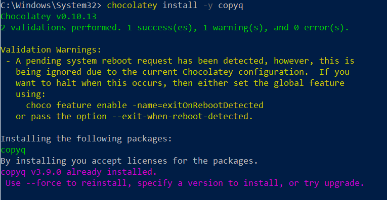

## Sample Checklist Using Stamps for "Done" Marking

Only Requires Typora.

### Preparation

Section start: **[STARTED 07/25/2019 @ 08:20]**

- [x] Setup widget masher with the following command:
  `widget masher on`

- [x] Record result of masher command:

  **RECORD OUTPUT:** "masher enabled"

- [x] Install CopyQ with following command and screenshot the result.
  `chocolatey install -y copyq`

  **RECORD SCREENSHOT:**

   

- [ ] Setup a maintenance window in pager duty at this url: https://pagerduty.com/thisservice/window

- [ ] Setup the production rollout with these settings:

    | Setting Name | Setting Value |
    | ------------ | ------------- |
    | Production   | True          |
    | RolloutRate  | 40            |

### Begin Deployment

- [ ] Kickoff the masher deployment with this command:
  `masher deploy production now`

- [ ] Wait for completion and record completion time.

**COMPETION DURATION:** **[RECORD RESULT HERE]**